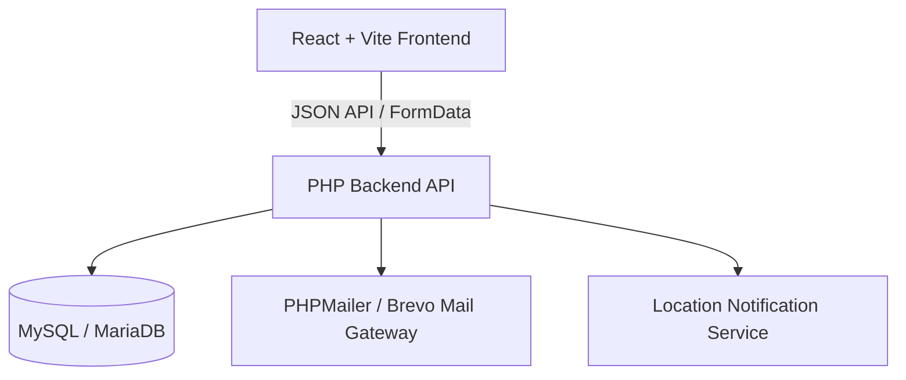

# Findora - Smart Community Reporting & Lost/Found Platform


**Findora** is a unified community reporting web platform designed to streamline lost & found item recovery, missing person and pet alerts, and suspicious incident reporting. Featuring intelligent report matching, automated city-wide email notifications, and an admin verification system, Findora connects communities to return lost belongings and missing loved ones home safely.

---

## 📌 Project Overview

- **Group Number**: CST-21
- **Department**: Department of Computer Science & Technology
- **University**: Uva Wellassa University of Sri Lanka

---

## 👥 Group & Supervisor Details

### Group Members (Group No: CST-21)

| No. | Student Name | Index Number | Student Email |
| :-: | :--- | :-: | :--- |
| **01** | R.M.N.T. Yashintha | `UWU/CST/23/064` | [cst23064@std.uwu.ac.lk](mailto:cst23064@std.uwu.ac.lk) |
| **02** | K.M. Navodya | `UWU/CST/23/029` | [cst23029@std.uwu.ac.lk](mailto:cst23029@std.uwu.ac.lk) |
| **03** | S.D.O. Sandew | `UWU/CST/23/005` | [cst23005@std.uwu.ac.lk](mailto:cst23005@std.uwu.ac.lk) |
| **04** | J.M.D.K. Weerathunga | `UWU/CST/23/061` | [cst23061@std.uwu.ac.lk](mailto:cst23061@std.uwu.ac.lk) |

### Academic Supervisors

| Supervisor Name | Designation / Email | Contact Number |
| :--- | :--- | :--- |
| **Ms. K.A.A. Chathurangi** | [ayesha.c@uwu.ac.lk](mailto:ayesha.c@uwu.ac.lk) | 077 408 6621 |
| **Ms. Y. Milani** | [milaniyoges@gmail.com](mailto:milaniyoges@gmail.com) | 076 984 7175 |

---

## ✨ Key Features

1. **Lost & Found Reporting**: Submit lost or found item posts with detailed locations, timestamps, categories, and images.
2. **Missing Person & Missing Pet Alerts**: Dedicated reporting workflows with custom attributes (age, gender, distinguishing features, pet categories).
3. **Automated Location Notification Engine**: Instant location-based email dispatch to registered users in the same nearest town when a missing person or missing pet report is approved.
4. **Smart Match Algorithm**: Automatically checks and matches lost and found item attributes to notify relevant owners and finders.
5. **Community Interactions & Moderation**: Integrated comments, reactions, and rewards system with secure administrative content approval.
6. **Role-Based Authentication**: Secure authentication system supporting standard users, verified shop owners, and administrators.

---

## 🏗 System Architecture & Tech Stack



- **Frontend**: React.js, Vite, TailwindCSS
- **Backend API**: PHP 8.x (OOP & Service-Repository Pattern)
- **Database**: MySQL / MariaDB
- **Mail Gateway**: PHPMailer / Brevo API SMTP
- **Web Server**: Apache (XAMPP / Production Hosting)

---

## 📂 Repository Structure

```text
Findora/
├── findora-frontend/             # React + Vite Frontend Application
│   ├── src/                      # Components, Pages, and Assets
│   ├── public/                   # Public Static Assets
│   ├── package.json              # Frontend Dependencies
│   └── vite.config.js            # Vite Configuration
│
└── findora-backend/              # PHP REST API Backend
    ├── admin/                    # Admin Dashboard API Endpoints
    ├── auth/                     # Authentication & Profile Management
    ├── classes/                  # Services, Repositories, Security Guards
    ├── config/                   # Database & Mail Environment Configurations
    ├── database/                 # SQL Schemas and Migrations
    ├── helpers/                  # Helper Utilities & Notification Triggers
    ├── interactions/             # Comments and Reactions Handlers
    ├── matching/                 # Report Matching Engine
    ├── public_posts/             # Public Post Feed Endpoints
    ├── reports/                  # Lost, Found, Missing Person & Pet Endpoints
    └── uploads/                  # Uploaded Image Assets Storage
```

---

## 🚀 Getting Started

### Prerequisites

- **Node.js** (v18+ recommended) & **npm**
- **XAMPP / WAMP** with **PHP 8.1+** and **MySQL**
- **Composer** (for PHP dependencies)

### Backend Setup (`findora-backend`)

1. **Database Initialization**:
   - Start Apache and MySQL in XAMPP Control Panel.
   - Open phpMyAdmin (`http://localhost/phpmyadmin`).
   - Create a database named `findora_db`.
   - Import the database schema from [`findora-backend/database/findora_db.sql`](file:///c:/xampp/htdocs/findora-backend/database/findora_db.sql).

2. **Environment Configuration**:
   - Copy `config/db.example.php` to `config/db.php`:
     ```bash
     cp config/db.example.php config/db.php
     ```
   - Copy `config/.env.example` to `config/.env` and specify mail credentials (`BREVO_API_KEY`, `MAIL_USERNAME`, `MAIL_PASSWORD`).

3. **Run Backend**:
   - Deploy `findora-backend` inside your local server web directory (e.g. `C:/xampp/htdocs/findora-backend`).

### Frontend Setup (`findora-frontend`)

1. **Install Dependencies**:
   ```bash
   cd findora-frontend
   npm install
   ```

2. **Configure API Base URL**:
   - Create a `.env` file in `findora-frontend`:
     ```env
     VITE_API_BASE_URL=http://localhost/findora-backend
     ```

3. **Start Development Server**:
   ```bash
   npm run dev
   ```
   - Open your browser at `http://localhost:5173`.

---

## 🛡 License & Acknowledgments

Developed as an academic capstone project at **Uva Wellassa University of Sri Lanka**. All rights reserved.

